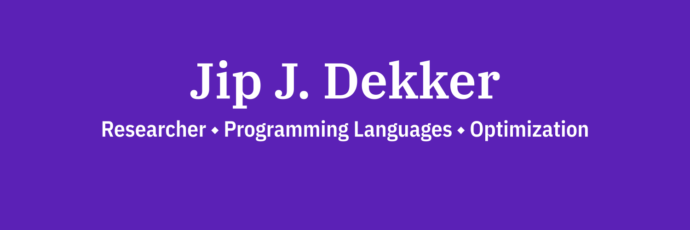

[][1]

	
	
	

Hi 👋,

I am a researcher with a passion for programming languages, optimization, and community building.
Above all, my research interests lie in devising state-of-the-art methods to solve challenging tasks.
I have dedicated the majority of my research to the development of the [MiniZinc][2] language, a programming language to model and solve decision and optimization problems.

For more information about me and my research, you can visit [dekker.one][1].

## 📬 Get in touch

- Web: [dekker.one][1]
- Fediverse: [@Dekker1@hachyderm.io][3]
- Twitter (not very active): [twitter.com/DekkerOne][4]

[1]: https://dekker.one
[2]: https://www.minizinc.org
[3]: https://hachyderm.io/@Dekker1
[4]: https://twitter.com/DekkerOne
